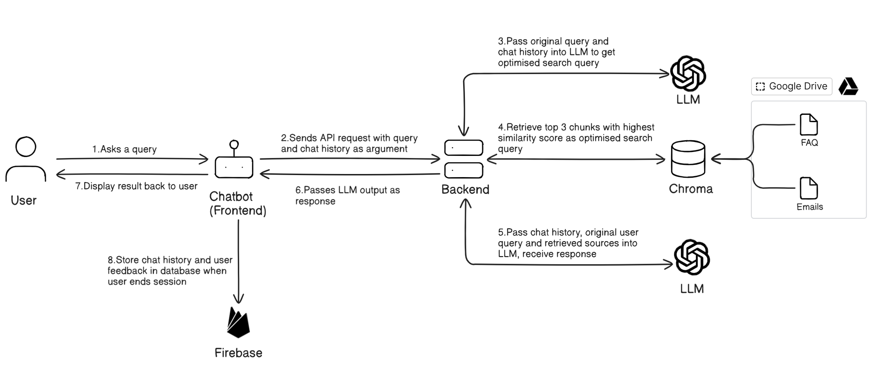
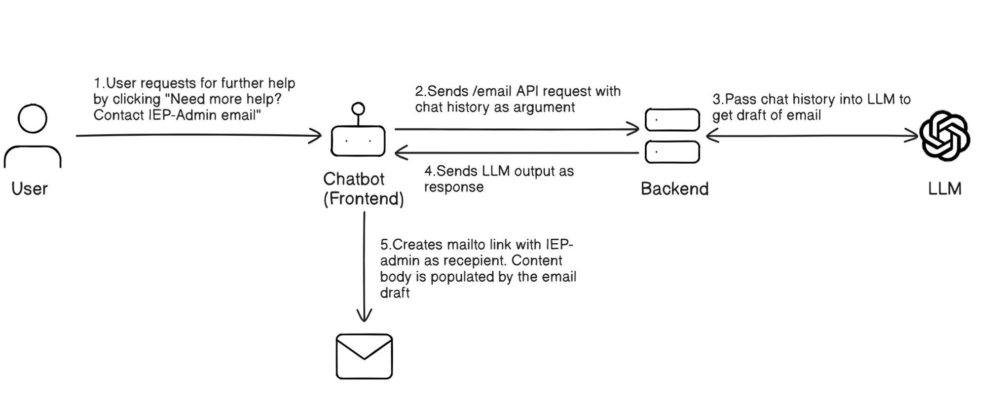
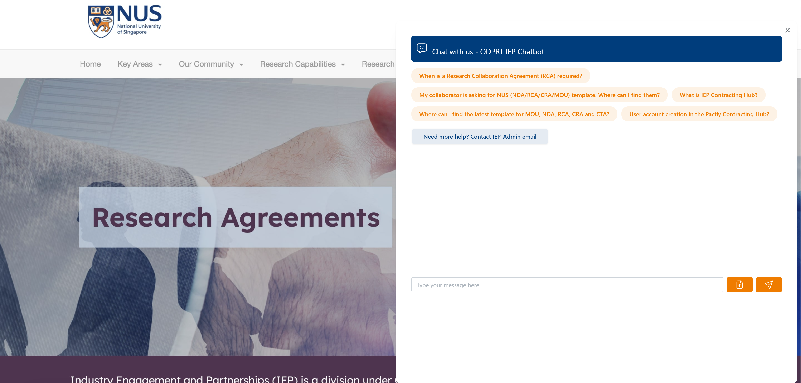
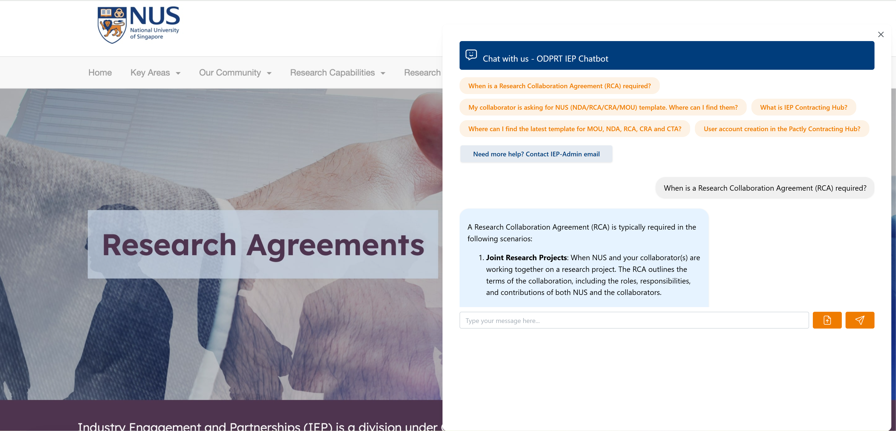
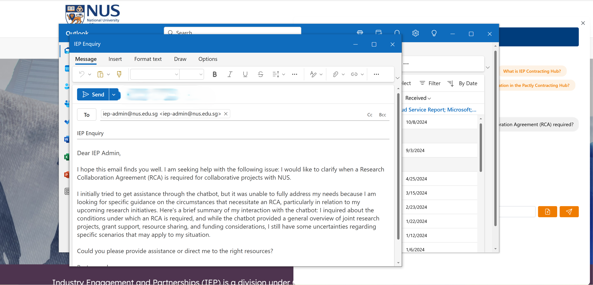
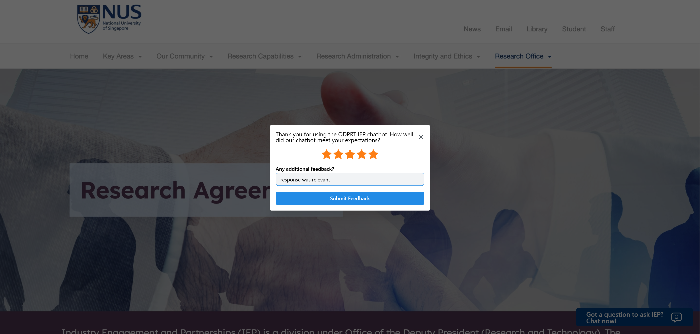

# ODPRT Chatbot
A chatbot designed to answer questions relating to the ODPRT department.

- [Features](#features)
  - [Architecture Diagram](#architecture-diagram)
  - [Application Flow](#application-flow)
- [Getting Started](#getting-started)
  - [Prerequisites](#prerequisites)
  - [Installation](#installation)
  - [Configuration](#configuration)
  - [Running Locally](#running-locally)
- [Usage](#usage)
  - [Backend API](#backend-api)
  - [Frontend Interface](#frontend-interface)

## Features
- Chat (multi-turn) and Q&A (single turn) interfaces
- Ability to draft emails based on conversation history to get further help from IEP department
- Get relevant answers by retrieving related documents from the vector database
- Ability to store conversation history
- Provide feedback to the chatbot
- Attach documents to the chatbot (NOT COMPLETED)

### Architecture Diagram

*/chat application flow*


*/email application flow*


### Application Flow
1. User inputs question to the chatbot or selects one of the 5 most frequently asked questions
2. Frontend sends `/chat` API call containing question and chat history
3. Backend guardrails first check if question contains harmful materials (jailbreak attempts, vulgarities etc.). If detected, backend sends response saying it is unable to answer question
4. Backend calls LLM API with question and chat history to obtain an optimised search query
5. Backend uses optimised search query to get top 3 most relevant documents from the vector database
6. Backend calls LLM API with question, chat history and retrieved sources to get chatbot response
7. Backend sends back response to frontend
8. Frontend displays result back to user
9. If user wants further clarification by emailing IEP department, user clicks on "Need more help? Contact IEP-Admin email"
10. Frontend sends `/email` API call containing chat history
11. Backend calls LLM API with chat history to get draft of email containing summary of chat conversation
12. Backend sends back email draft response to frontend
13. Frontend triggers a mailto link populated with email draft 
14. When user is done interacting with chatbot and exits, feedback modal pops up

## Getting Started

### Prerequisites
- Python 3.8 or higher
- Node.js 14.x or higher
- Google Cloud Platform account
- Firebase account
- Chrome/Firefox/Safari browser

### Installation
1. Git clone this repository
```shell
git clone https://github.com/dylanlo8/ODPRT-chatbot.git
```
2. Create a virtual environment in the root directory of this project and install backend dependencies

#### Miniconda

```zsh
# make script executable
chmod +x bootstrap.sh

# run script
./env/bootstrap.sh
```
---

```zsh
# activate whenever coding
conda activate odprt
```

#### venv

You can use Python's native virtual environment `venv` to setup the project

```zsh
# Create a virtual environment
python -m venv odprt
```

You can then activate the environment and install the dependencies using the following commands -

For Unix-based systems (macOS / Linux):

```zsh
# Activate virtual environment
source odprt/bin/activate

# Install dependencies
pip install -r requirements.txt
```

For Windows:

```powershell
# Activate virtual environment
.\odprt\Scripts\activate

# Install dependencies
pip install -r requirements.txt
```

> [!TIP]
> If you're using Python's native virtual environment `venv`, it is best practice to name your virtual environment `venv`.

3. Install frontend dependencies

Navigate to `chatbot/frontend`
```shell
cd chatbot/frontend
```
Install dependencies
```shell
npm install
```

4. Install pre commit hook in root directory
```shell
pre-commit install
```

This command sets up the git hooks and run them automatically before every commit. For more information, refer to the [pre-commit docs](https://pre-commit.com/). To see what hooks are used, refer to the [`.pre-commit-config.yaml`](.pre-commit-config.yaml) YAML file.

#### (Optional) Run `pre-commit run --all-files`

Optionally, you can also run the command `pre-commit run --all-files` to lint and reformat your code. It's usually a good idea to run the hooks against all of the files when adding new hooks (usually pre-commit will only run on the changed files during git hooks).

> [!NOTE]
> The `pre-commit` will run regardless if you forget to explicitly call it. Nonetheless, it is recommended to call it explicitly so you can make any necessary changes in advanced.

### Configuration
1. Create a .env file in the root directory.

2. Add following variables to the .env file, which can also be found in example.env
```shell
EMAIL_DOCUMENT_ID=
FAQ_DOCUMENT_ID=
MISTRAL_API_KEY=
MISTRAL_MODEL=
MODEL=
OPENAI_API_KEY=
OPENAI_MODEL=
REACT_APP_FIREBASE_API_KEY=
REACT_APP_FIREBASE_AUTH_DOMAIN=
REACT_APP_FIREBASE_PROJECT_ID=
REACT_APP_FIREBASE_STORAGE_BUCKET=
REACT_APP_FIREBASE_MESSAGING_SENDER_ID=
REACT_APP_FIREBASE_APP_ID=
```
The following steps will detail how to set up the resources required and get the variables listed above

#### Setting up LLM models

##### OpenAI
To get an OpenAI API key, you can follow the steps listed in this [article](https://medium.com/@lorenzozar/how-to-get-your-own-openai-api-key-f4d44e60c327). Thereafter, set `OPENAI_API_KEY` to the API key you just obtained and `OPENAI_MODEL` to the GPT model for your LLM (eg gpt-4o-mini).

##### Mistral
To get a Mistral API key, you can follow the steps listed in this [article](https://docs.mindmac.app/how-to.../add-api-key/create-mistral-ai-api-key). Thereafter, set `MISTRAL_API_KEY` to the API key you just obtained and `MISTRAL_MODEL` to the Mistral model for your LLM (eg mistral-small-latest).

Finally, set `MODEL` to either `OPENAI` or `MISTRAL`, depending on the model you want to use.

#### Setting up Firebase
1. Go to the [Firebase Console](https://console.firebase.google.com/)
2. Click on "Create a project"
3. Enter project name, select default settings and click "Create Project"
4. Click on the web icon (</>)
5. Register your app with a nickname (e.g., "my-react-app")
6. Once registered, you'll see your configuration object with all these credentials
```shell
const firebaseConfig = {
  apiKey: "your-api-key",
  authDomain: "your-project-id.firebaseapp.com",
  projectId: "your-project-id",
  storageBucket: "your-project-id.appspot.com",
  messagingSenderId: "your-sender-id",
  appId: "your-app-id"
};
```
7. Copy these credentials into the respective variables below in your .env file
```shell
REACT_APP_FIREBASE_API_KEY=
REACT_APP_FIREBASE_AUTH_DOMAIN=
REACT_APP_FIREBASE_PROJECT_ID=
REACT_APP_FIREBASE_STORAGE_BUCKET=
REACT_APP_FIREBASE_MESSAGING_SENDER_ID=
REACT_APP_FIREBASE_APP_ID=
```

#### Setting up Google Cloud Platform
##### Setting up the Google Drive API:
1. Log in to Google Cloud Console: https://console.cloud.google.com/
2. Click on "Select a Project" and select "Create a Project". Name your project and click "create".
3. In the Google Cloud Console, navigate to the API Library
4. Search for Google Docs API, click on it, and click "Enable"
5. Search for Google Drive API, click on it, and click "Enable"
6. Go to the APIs & Services section
7. Click on Credentials on the left-hand menu
8. Click "Create Credentials", and select "OAuth 2.0 Client ID". Configure the consent screen if required, by selecting "External" for user type
9. Select application type as "Web app". Give it a name and click "Create"
10. Download the credentials file, and rename it "credentials.json". Place it in the folder ODPRT-CHATBOT/chatbot/backend/database. This file will be used in the chatbot's script

##### Setting up the Email data Google doc:
The format of your Email data Google doc should follow the one provided by our team. To update the email database, simply visit the Email data document to make your changes:
- Adding emails: under the category in which the Email to be added belongs, create new rows: with one row to input the subject of the email, and the next row to input the relevant Q&A pair present within the email thread. For the “Q&A pair” to be added,  always start the input with: “Question:”, and then the user query received, followed by “Answer:”, and then the IEP admin’s response to the question. For multiple Q&A pair within the same thread, do so in the same row in the following format:

      Question:
      User query 1
  
      Answer:
      IEP's response 1
  
      Question:
      User query 2
  
      Answer:
      IEP's response 2

- Do note that not the full thread has to be included (include only the insightful question and answer pairs), and to redact any sensitive information present. Do also remember to name the rows “Subject” and “Q&A pair” just like the rest of the dataset
- Removing emails: delete the rows of “subject” and “Q&A pair” belonging to the emails you’d like to remove from the dataset
- Editing existing emails: locate the email you wish to edit and edit it


##### Setting up the FAQ data Google doc:
The format of your FAQ data Google doc should follow the one provided by our team. To update the FAQ database, simply visit the FAQ data document, and make your edits: 
- Adding FAQs: under the category in which the FAQ to be added belongs, create new rows: with one row to input your questions and the next row to input your answer. Multiple questions with the same answer can be added into the same rows. Do remember to name the rows “Question” and “Answer” just like the rest of the dataset.
- Removing FAQs: delete the rows of “Question” and “Answer” which you would like removed
- Editing existing FAQs: locate the FAQ you wish to edit, and edit it


With that, the vector database will be automatically updated. Please note that while you are free to add any amount of questions under each category, you are unable to include other category types (ie: please stick to the existing 5 categories in the Email dataset and 6 categories in the FAQ dataset), nor change the name of each category type.

### Running Locally

#### Windows

From the root directory, run the following command:
```shell
./start.ps1
```
This script starts up both the backend and the frontend components sequentially. Alternatively, to set them up separately, you can run the following commands:

To set up the backend, run
```shell
python chatbot/backend/main.py
```
To set up the frontend, navigate to chatbot/frontend by running
```shell
cd chatbot/frontend
```
Then, run the command
```shell
npm start
```

#### Mac/Linux

From the root directory, run the following command:
```shell
./start.sh
```
This script starts up both the backend and the frontend components sequentially. Alternatively, to set them up separately, you can run the following commands:

To set up the backend, run
```shell
python chatbot/backend/main.py
```
To set up the frontend, navigate to chatbot/frontend by running
```shell
cd chatbot/frontend
```
Then, run the command
```shell
npm start
```

## Usage

### Backend API

`/chat` - Handle user queries and generate chatbot responses. Expects a POST request with JSON payload containing query (user's input message) and messages (conversation history)

`/email` - Generate an email draft based on chat conversation history. Expects a POST request with JSON payload containing messages (conversation history)

### Frontend Interface


*Page where chatbot will be hosted*



*Interface of the chatbot*



*Question and answer*



*Mailto link appears when user wants to email IEP department*



*Feedback modal pops up after user is done interacting with the chatbot*
