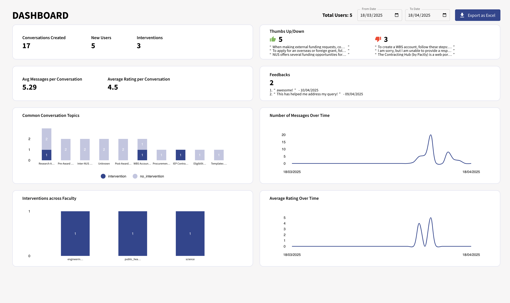

# ODPRT Chatbot
A chatbot designed to answer questions relating to the ODPRT department.

- [Features](#features)
  - [Architecture Diagram](#architecture-diagram)
- [Getting Started](#getting-started)
  - [Prerequisites](#prerequisites)
  - [Installation](#installation)
  - [Configuration](#configuration)
  - [Running Locally](#running-locally)
- [Usage](#usage)
  - [Backend API](#backend-api)
  - [Frontend Interface](#frontend-interface)

### Architecture Diagram


## Getting Started

### Prerequisites

Scripting Languages:
- Python 3.11 or higher
- Node.js 14.x or higher

Tech Stack and Cloud Services
- Milvus Vector DB: Zillis Cloud Account (FREE!)
- Supabase account (FREE!)

### Installation

#### Clone this repository
```bash
git clone https://github.com/dylanlo8/ODPRT-chatbot.git
```

#### Chatbot: Backend - `Virtual Environment`

##### For MAC

```bash
python -m venv .venv

source .venv/bin/activate 

cd env

python install.py
```

##### For WINDOWS

Note: On some systems, you may need to change the execution policy for PowerShell to allow script execution:

```bash
Set-ExecutionPolicy -ExecutionPolicy RemoteSigned -Scope CurrentUser

python -m venv .venv

.venv\Scripts\activate

cd env

python install.py
```

#### Chatbot: Backend - `Supabase (Postgresql Database for Conversation Histories)`

1. Copy the SQL Queries to create the Database from
```chatbot/backend/services/chat_history/sql_db_setup.py```
   
2. Navigate to your Supabase Project SQL Editor, paste and run the queries.
   


3. You are all set! The Conversations Histories Database has been created!
   

#### Chatbot: Frontend - `npm`

```bash
# navigate to frontend directory
cd chatbot/frontend

# install required libraries and packages
npm install

# run
npm run dev
```

#### Admin Dashboard: Frontend - `npm`

```bash
cd admin

npm install

npm start
```


### Configuration
1. Create a `.env` file in the root directory.

2. Add following variables to the `.env`
```shell
## for llms and vlms
OPENAI_API_KEY=
OPENAI_MODEL="gpt-4o-mini"
HYPERBOLIC_API_KEY=

## for databases
# Cloud Vector DB
ZILLIS_ENDPOINT=
ZILLIS_TOKEN=

# Bucket and Relational DB
SUPABASE_TOKEN=
SUPABASE_URL=
SUPABASE_SERVICE_KEY=

```

#### Getting your API Keys

##### OpenAI
To get an OpenAI API key, you can follow the steps listed in this [article](https://medium.com/@lorenzozar/how-to-get-your-own-openai-api-key-f4d44e60c327). Thereafter, set `OPENAI_API_KEY` to the API key you just obtained and `OPENAI_MODEL` to the GPT model for your LLM (eg gpt-4o-mini).

##### Hyperbolic

Navigate to https://app.hyperbolic.xyz/settings and copy the API Key

##### Zillis Cloud
Create a Cluster > Navigate to your Zillis Cloud Cluster and find the API Token.

##### Supabase

In your Supabase Console, navigate to Project Settings > Data API and copy the following information with reference to the image below.

SUPABASE_URL= copy from url

SUPABASE_TOKEN= copy the public token

SUPABASE_SERVICE_KEY= copy from service role


## Running Locally

### WINDOWS

From the root directory, run the following command:
```shell
./start.ps1
```

### Mac/Linux

From the root directory, run the following command:
```shell
./start.sh
```

## Usage

### Backend API

`/chat` - Handle user queries and generate chatbot responses. Expects a POST request with JSON payload containing query (user's input message) and messages (conversation history)

`/email` - Generate an email draft based on chat conversation history. Expects a POST request with JSON payload containing messages (conversation history)

## Frontend Interface

### Chatbot


*Page where chatbot will be hosted*


*Interface of the chatbot*


*Question and answer*


*Mailto link appears when user wants to email IEP department*


*Feedback modal pops up after user is done interacting with the chatbot*

### Admin 


*Page where dashboard will be hosted* 


*Upload files for database ingestion* 
